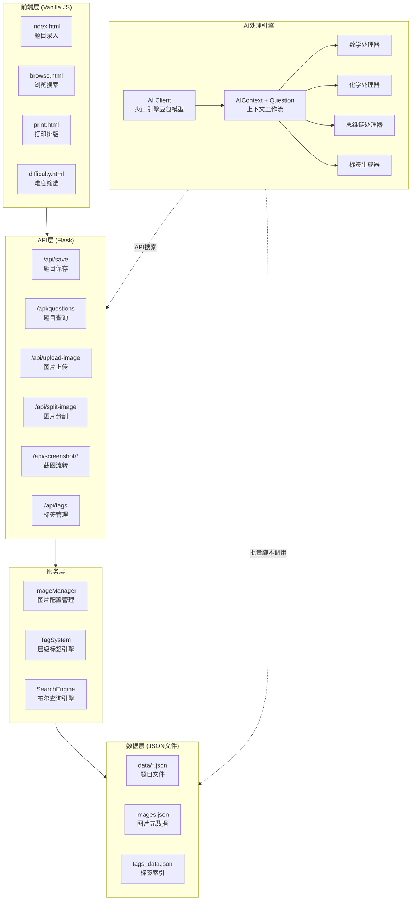

这是一个面向中学教育场景的**错题收录与AI智能分析系统**——它将截图截图录入、结构化存储、标签分类、搜索引擎、AI深度分析（数学拆分归类、化学难点提取、思维链生成等）与打印排版，整合为一个自包含的全栈应用。系统采用 **Flask + 原生 JavaScript** 技术栈，以 JSON 文件替代数据库，实现了零依赖部署和极简运维。

Sources: [app.py](app.py#L1-L29), [DEVELOPER.md](DEVELOPER.md#L1-L50)

## 系统定位与核心价值

本系统解决的核心问题是：**学生和教师在日常学习中产生的错题，如何从"截图碎片"变为"可检索、可分析、可训练的结构化知识资产"**。系统的价值链可以概括为四个阶段：

| 阶段 | 功能 | 关键模块 |
|------|------|----------|
| **录入** | 截图上传、图片分割、富文本编辑 | `app.py` API层 + 前端 `index.html` |
| **组织** | 层级标签、布尔搜索、图片配置管理 | `tag_system.py` + `search_engine.py` + `image_manager.py` |
| **分析** | AI驱动的题目拆分、归类、难点提取、思维链生成 | `ai/` 模块群 |
| **输出** | 打印排版、LaTeX渲染、难度筛选 | `print.html` + `difficulty.html` |

Sources: [app.py](app.py#L181-L204), [tag_system.py](tag_system.py#L1-L16), [ai/__init__.py](ai/__init__.py#L1-L34)

## 系统架构全景

下图展示了系统从用户交互到数据持久化的完整分层架构：



Sources: [app.py](app.py#L1-L41), [ai/__init__.py](ai/__init__.py#L1-L63), [image_manager.py](image_manager.py#L11-L16)

## 技术栈一览

系统刻意选择了**最小化外部依赖**的技术路线，使得整个项目可以仅凭 Python 环境和浏览器直接运行：

| 层级 | 技术 | 版本/说明 | 用途 |
|------|------|-----------|------|
| **后端框架** | Flask | 2.x | HTTP API 服务器 |
| **跨域支持** | Flask-CORS | - | 前后端分离开发 |
| **图片处理** | Pillow | - | 图片裁剪分割、尺寸读取 |
| **AI SDK** | volcengine-python-sdk | Ark Runtime | 火山引擎豆包大模型调用 |
| **前端核心** | 原生 JavaScript | ES6+ | 全部交互逻辑，无框架依赖 |
| **公式渲染** | KaTeX | 0.16.9 | LaTeX 数学公式实时渲染 |
| **Markdown** | marked | - | AI 输出的 Markdown 文本解析 |
| **PDF查看** | PDF.js | - | PDF 文档在线浏览 |
| **数据存储** | JSON 文件 | - | 零数据库，文件系统即存储 |

Sources: [DEVELOPER.md](DEVELOPER.md#L22-L49), [static/index.html](static/index.html#L7-L8)

## 核心模块速览

系统由以下六大核心模块构成，每个模块职责清晰、边界分明：

### 1. 主应用 (app.py)

Flask 应用的唯一入口，承担**路由分发、请求协调、数据编排**三重职责。它不包含业务逻辑本身，而是将请求委派给各服务模块处理。关键职责包括：初始化所有服务实例（`ImageManager`、`TagSystem`、`SearchEngine`），定义 15+ 个 API 端点，以及处理图片项的压缩/展开双向转换（`process_image_items` / `expand_image_items`）。

Sources: [app.py](app.py#L1-L41), [app.py](app.py#L77-L179)

### 2. 图片管理系统 (ImageManager)

采用**图片-配置分离**的设计：一张物理图片（`images`）可关联多个显示配置（`configs`），每个配置独立记录显示方式、尺寸、charBox 标注、splitLines 分割线等参数。这种设计让同一张图片在不同题目中可以有不同的展示方式，而无需重复存储文件。线程安全通过 `threading.RLock` 保证。

Sources: [image_manager.py](image_manager.py#L11-L196)

### 3. 标签系统 (TagSystem)

实现了**层级式标签树**（以 `::` 分隔层级，如 `打印::数学::一4/5`）和**布尔查询引擎**。支持五种匹配模式：精确、前缀、后缀、包含、正则。查询表达式支持 `AND`、`OR`、`NOT` 逻辑运算符和括号分组，通过递归下降解析器实现。

Sources: [tag_system.py](tag_system.py#L8-L141)

### 4. 搜索引擎 (SearchEngine)

独立于标签系统的全文搜索引擎，同样实现了**布尔查询语法**。它将查询字符串词法分析为 `Token`，构建抽象语法树（`ASTNode`），再对每条题目执行匹配评估。支持标签过滤（`tag:` 前缀）、短语匹配（双引号包裹）、否定排除（`-` 前缀）等高级语法。内置缓存机制，数据变更时自动失效。

Sources: [search_engine.py](search_engine.py#L1-L100)

### 5. AI 处理引擎 (ai/)

这是系统最具特色的部分，采用**三层架构**设计：

- **底层 — AI 客户端** (`ai_client.py`)：封装火山引擎 Ark SDK，提供 `call_ai`、`call_ai_json`、`call_ai_stream` 等原子调用函数，支持多模型切换、推理强度控制（`ReasoningEffort`）、并行调用（`parallel_map`）
- **中层 — 工作流** (`workflow.py`)：定义 `AIContext`（数据目录 + AI 实例 + 搜索能力）和 `Question`（题目数据对象 + AI 调用方法），提供 `batch_ai` 批量处理入口
- **顶层 — 学科处理器**：数学 (`math_processor.py`)、化学 (`chemistry_processor.py`)、思维链 (`thinking_processor.py`)、标签 (`tag_processor.py`) 等，各自封装领域提示词和处理逻辑

Sources: [ai/ai_client.py](ai/ai_client.py#L1-L65), [ai/workflow.py](ai/workflow.py#L31-L111), [ai/__init__.py](ai/__init__.py#L1-L34)

### 6. 前端应用 (static/)

四个 HTML 页面配合五个 JS 模块构成完整的前端应用：

| 页面 | 功能 | 说明 |
|------|------|------|
| `index.html` | 题目录入 | 左右分栏：左编辑、右预览；支持粘贴截图、富文本、图片标注 |
| `browse.html` | 浏览搜索 | 列表+搜索+标签筛选 |
| `print.html` | 打印排版 | 题目选择与打印布局 |
| `difficulty.html` | 难度筛选 | 化学难点选择页面 |

| JS模块 | 职责 |
|--------|------|
| `api.js` | 后端 API 通信封装 |
| `state.js` | 发布-订阅状态管理 |
| `utils.js` | LaTeX渲染、HTML转义、数据清洗 |
| `content-renderer.js` | 内容项（文本/图片）渲染 |
| `image-handler.js` | 图片上传、分割、标注交互 |

Sources: [static/js/api.js](static/js/api.js#L1-L37), [static/js/state.js](static/js/state.js#L5-L50), [static/js/utils.js](static/js/utils.js#L1-L30)

## 数据模型与存储设计

系统采用**每题一文件**的 JSON 存储策略，所有数据文件以题目 ID（时间戳格式）命名：

```json
{
  "id": "20260405151708",
  "created_at": "2026-04-05 15:17:08",
  "question": { "items": [{"type": "image", "config_id": "cfg_xxx"}] },
  "answer": { "items": [] },
  "tags": ["数学", "打印::数学::一4/5"],
  "sub_questions": [],
  "math_processing_result": [...]
}
```

内容采用 **items 数组**统一表达文本和图片：`type: "text"` 为纯文本，`type: "richtext"` 为富文本片段（支持下划线标注），`type: "image"` 通过 `config_id` 引用图片配置。AI 处理结果（如 `math_processing_result`、`chemistry_preprocessing`）直接追加到同一 JSON 文件中，形成**渐进式数据丰富**的模式。

Sources: [data/20260405151708.json](data/20260405151708.json#L1-L55), [app.py](app.py#L253-L319)

## AI 分析能力概览

系统接入了火山引擎**豆包系列大模型**，提供多种推理强度（`minimal` → `high`）和模型规格选择。AI 的核心分析能力包括：

| 处理器 | 功能 | 输出字段 |
|--------|------|----------|
| **数学处理器** | 题目拆分归类 + 思维链深度解析 | `math_processing_result` |
| **化学处理器** | 知识积累点 + 难点提取 | `chemistry_preprocessing` |
| **思维链处理器** | 沉浸式思维过程生成 | `thinking_process` |
| **标签处理器** | 自动标签生成 | `tags` |
| **通用处理器** | 任意 prompt + 输出字段 | 用户自定义字段 |
| **评估器** | 题目质量评估 | `evaluation` |

AI 分析通常以**批量脚本**方式运行（如 `batch_preprocess_v2.py`），通过 `BatchProgress` 跟踪进度，支持跳过已处理题目、失败重试、并行加速。

Sources: [ai/ai_client.py](ai/ai_client.py#L34-L80), [ai/math_processor.py](ai/math_processor.py#L1-L57), [ai/chemistry_processor.py](ai/chemistry_processor.py#L1-L60), [ai/batch.py](ai/batch.py#L13-L95)

## API 端点汇总

系统提供以下核心 API 端点，全部以 JSON 格式交互：

| 端点 | 方法 | 功能 |
|------|------|------|
| `/api/save` | POST | 创建/更新题目 |
| `/api/questions` | GET | 分页查询题目（支持搜索） |
| `/api/questions/<id>` | PUT | 更新指定题目 |
| `/api/questions/<id>` | DELETE | 删除指定题目 |
| `/api/upload-image` | POST | 上传图片（Base64） |
| `/api/split-image` | POST | 按分割线裁剪图片 |
| `/api/screenshot/upload` | POST | 上传待流转截图 |
| `/api/screenshot/check` | GET | 检查待处理截图 |
| `/api/screenshot/consume/<id>` | POST | 消费截图（移入正式目录） |
| `/api/tags` | GET | 获取标签树和全部标签 |
| `/api/questions/batch-add-tag` | POST | 批量添加标签 |
| `/api/images` | GET | 获取全部图片和配置 |
| `/api/images/<config_id>` | GET | 获取指定图片配置详情 |
| `/api/clean-split-cache` | POST | 清理过期分割缓存 |

Sources: [app.py](app.py#L206-L250), [app.py](app.py#L321-L380), [app.py](app.py#L446-L460), [app.py](app.py#L583-L614), [app.py](app.py#L697-L772)

## 错误处理体系

系统采用**统一异常体系**，所有业务错误继承自 `AppError` 基类，自动携带错误码、HTTP 状态码和详情信息。Flask 全局错误处理器确保所有异常都以结构化 JSON 响应返回：

| 异常类 | 状态码 | 错误码 | 场景 |
|--------|--------|--------|------|
| `ValidationError` | 400 | `VALIDATION_ERROR` | 请求参数校验失败 |
| `NotFoundError` | 404 | `NOT_FOUND` | 资源不存在 |
| `ConflictError` | 409 | `CONFLICT` | 资源冲突 |
| `InternalError` | 500 | `INTERNAL_ERROR` | 服务器内部错误 |

Sources: [errors.py](errors.py#L1-L82), [app.py](app.py#L817-L854)

## 阅读导航

本概览页面为你勾勒了系统的全貌。建议按照以下路径深入阅读：

**第一步：动手运行**
→ [快速启动与运行](2-kuai-su-qi-dong-yu-yun-xing) — 启动系统、配置 AI 密钥、完成第一次录入

**第二步：理解结构**
→ [项目目录结构与文件组织](3-xiang-mu-mu-lu-jie-gou-yu-wen-jian-zu-zhi) — 每个文件和目录的详细用途

**第三步：深入架构**
→ [核心架构与请求处理流程](4-he-xin-jia-gou-yu-qing-qiu-chu-li-liu-cheng) — 一个请求从浏览器到 JSON 文件的完整旅程
→ [数据模型与JSON文件存储设计](5-shu-ju-mo-xing-yu-jsonwen-jian-cun-chu-she-ji) — items 数组、图片配置、AI 结果的数据结构

**第四步：按需深入**
- 后端开发 → [题目管理 API](6-ti-mu-guan-li-api-zeng-shan-gai-cha-yu-pi-liang-cao-zuo) / [图片上传与截图处理 API](7-tu-pian-shang-chuan-yu-jie-tu-chu-li-api)
- AI 能力 → [AI 工作流三层架构设计](9-ai-gong-zuo-liu-san-ceng-jia-gou-she-ji) / [学科专用处理器](13-xue-ke-zhuan-yong-chu-li-qi-shu-xue-hua-xue-si-wei-lian)
- 前端开发 → [前端架构与模块化设计](19-qian-duan-jia-gou-yu-mo-kuai-hua-she-ji) / [内容渲染与 LaTeX/Markdown 排版](20-nei-rong-xuan-ran-yu-latex-markdown-pai-ban)