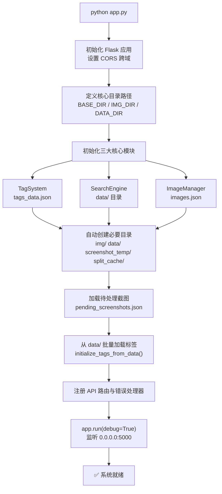
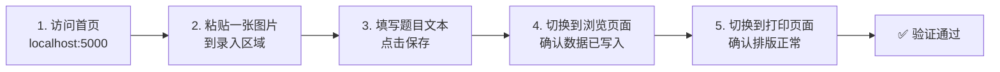

本页将带你从零开始，完成项目环境的搭建、配置与首次启动。整个流程分为**环境准备、依赖安装、配置设定、服务启动、功能验证**五个阶段，每个阶段均提供可操作的步骤与验证点，确保你在最短时间内看到系统运行起来的完整面貌。

## 系统启动全景图

在进入具体步骤之前，先建立对启动流程的整体认知。以下流程图展示了从命令行执行 `python app.py` 到系统完全就绪的全过程：



这个启动链路的关键特征是**零外部依赖的自动初始化**——所有必要目录会在启动时自动创建，JSON 数据文件若不存在也会以空结构自动生成，因此首次启动不会因缺失文件而失败。

Sources: [app.py](app.py#L1-L59)

## 环境准备

### 运行环境要求

| 项目 | 最低要求 | 推荐版本 | 说明 |
|------|---------|---------|------|
| Python | 3.10+ | 3.10+ | 使用了 `Optional[str]` 等类型语法，需 3.10 及以上 |
| 操作系统 | Windows / macOS / Linux | Windows | 项目包含 `docxpdf.py` 等 Windows 专用工具，但核心功能跨平台 |
| 磁盘空间 | 100MB+ | 500MB+ | 图片数据会持续增长，`img/` 和 `split_cache/` 为主要空间消耗 |
| 网络 | 可选 | 需要访问火山引擎 API | AI 功能需联网；纯录入/浏览功能可离线运行 |

Sources: [DEVELOPER.md](DEVELOPER.md#L22-L33)

### Python 依赖包

项目没有提供 `requirements.txt` 文件，但根据代码中的 `import` 语句，以下是完整的依赖清单：

| 包名 | 用途 | 谁需要 | 安装命令 |
|------|------|--------|---------|
| **Flask** | Web 框架，提供 HTTP API | 核心必需 | `pip install flask` |
| **Flask-CORS** | 跨域资源共享支持 | 核心必需 | `pip install flask-cors` |
| **Pillow** | 图片处理（尺寸读取、分割裁剪） | 核心必需 | `pip install pillow` |
| **volcenginesdkarkruntime** | 火山引擎豆包大模型 SDK | AI 功能必需 | `pip install volcenginesdkarkruntime` |

**核心必需**意味着不安装则 `app.py` 无法启动；**AI 功能必需**意味着不安装时 Web 服务仍可正常运行，但 AI 批处理脚本将无法使用。

Sources: [app.py](app.py#L1-L16), [ai/ai_client.py](ai/ai_client.py#L10)

### 一键安装所有依赖

```bash
pip install flask flask-cors pillow volcenginesdkarkruntime
```

如果你暂时不需要 AI 功能，可以先只安装核心依赖：

```bash
pip install flask flask-cors pillow
```

## 配置设定

### API Key 配置（AI 功能专用）

AI 模块通过环境变量 `ARK_API_KEY` 读取火山引擎的 API 密钥。如果你的工作流涉及 AI 处理，必须完成此配置。

**Windows（临时生效，仅当前终端）：**

```cmd
set ARK_API_KEY=your-api-key-here
```

**Windows（永久生效，写入系统环境变量）：**

```cmd
setx ARK_API_KEY "your-api-key-here"
```

**Linux / macOS：**

```bash
export ARK_API_KEY="your-api-key-here"
```

代码内部会按优先级查找 API Key：先检查 `AI` 对象的 `api_key` 参数，若为空则回退到环境变量 `ARK_API_KEY`，若两者均未配置则抛出 `ValueError("API KEY未配置")` 异常。

Sources: [ai/ai_client.py](ai/ai_client.py#L137-L139)

### 数据目录自动初始化

项目采用 **JSON 文件存储**，无需数据库。启动时 `app.py` 会自动执行以下初始化：

```python
os.makedirs(IMG_DIR, exist_ok=True)         # img/ - 图片存储
os.makedirs(DATA_DIR, exist_ok=True)         # data/ - 题目 JSON
os.makedirs(SCREENSHOT_DIR, exist_ok=True)   # screenshot_temp/ - 截图临时
os.makedirs(SPLIT_CACHE_DIR, exist_ok=True)  # split_cache/ - 分割缓存
```

| 目录 | 数据文件 | 自动创建 | 说明 |
|------|---------|---------|------|
| `data/` | `*.json`（每题一个文件） | ✅ | 题目数据目录，文件名即题目 ID |
| `img/` | `*.png/jpg/gif` | ✅ | 上传的题目图片 |
| `screenshot_temp/` | `*.png` | ✅ | 截图工具的临时暂存 |
| `split_cache/` | `MD5哈希/part_*.png` | ✅ | 图片分割结果的缓存 |
| 根目录 | `tags_data.json` | ✅ | 标签系统数据（空时自动生成） |
| 根目录 | `images.json` | ✅ | 图片元数据索引（空时自动生成） |
| 根目录 | `pending_screenshots.json` | ✅ | 待消费截图队列 |

**你无需手动创建任何目录或数据文件**，首次启动时系统会自动建立完整的数据结构。

Sources: [app.py](app.py#L24-L59)

## 启动服务

### 启动 Web 服务

在项目根目录下执行：

```bash
python app.py
```

启动成功后，终端将显示 Flask 的默认输出：

```
 * Serving Flask app 'app'
 * Debug mode: on
 * Running on all addresses (0.0.0.0)
 * Running on http://127.0.0.1:5000
```

服务默认监听 **`0.0.0.0:5000`**，以 debug 模式运行，支持代码修改后自动热重载。

Sources: [app.py](app.py#L857-L859)

### 访问前端页面

服务启动后，在浏览器中访问以下地址：

| 页面 | URL | 功能 |
|------|-----|------|
| **录入页面** | `http://localhost:5000/` | 题目录入、粘贴图片、标签管理 |
| **浏览页面** | `http://localhost:5000/browse` | 搜索浏览、批量标签、查看详情 |
| **打印页面** | `http://localhost:5000/print` | 题目排版与打印输出 |
| **难度选择** | `http://localhost:5000/difficulty` | 化学难点教学筛选 |
| **PDF 查看器** | `http://localhost:5000/pdf` | 内嵌 PDF.js 查看器 |

Sources: [app.py](app.py#L181-L204)

### 启动验证清单

启动服务后，按以下清单逐一验证核心功能是否正常：



| 序号 | 验证项 | 操作 | 预期结果 |
|------|-------|------|---------|
| 1 | Web 服务正常 | 浏览器访问 `localhost:5000` | 看到录入页面，左半为输入区，右半为预览区 |
| 2 | 图片上传 | 在输入区粘贴截图 | 图片显示在预览区 |
| 3 | 题目保存 | 填入文本后点击保存 | 右上角提示保存成功 |
| 4 | 数据持久化 | 刷新浏览页面 | 能搜到刚才保存的题目 |
| 5 | API 可用 | 访问 `localhost:5000/api/tags` | 返回 JSON 格式的标签数据 |

Sources: [app.py](app.py#L181-L204), [static/index.html](static/index.html#L1-L10)

## AI 工作流快速上手

Web 服务是系统的日常运行形态，而 AI 工作流则是通过独立 Python 脚本调用的批处理模式。两者共享同一套 `data/` 目录数据，互不干扰。

### 最简 AI 调用示例

确保 `ARK_API_KEY` 已配置且 Web 服务正在运行，然后创建一个脚本：

```python
from ai import AIContext

# 创建上下文 —— data_dir 指向题目数据目录
ctx = AIContext(data_dir="data")

# 搜索带"化学"标签的题目
questions = ctx.search("tag:化学")

# 对第一道题调用 AI 分析
if questions:
    result = questions[0].ai("请分析这道题目的解题思路")
    print(f"题目 {questions[0].id}: {result[:100]}...")
```

### AI 配置预设

`AI` 对象提供了三种开箱即用的配置预设，适用于不同深度的分析场景：

| 预设方法 | 推理深度 | 最大输出 | 适用场景 |
|---------|---------|---------|---------|
| `AI.fast()` | low | 32,768 | 快速标签生成、简单分类 |
| `AI.think()` | high | 131,072 | 标准分析、思维链推理（**默认**） |
| `AI.deep()` | high | 262,144 | 深度分析、复杂多步推理 |

Sources: [ai/ai_client.py](ai/ai_client.py#L58-L79), [ai/workflow.py](ai/workflow.py#L31-L62), [AI_WORKFLOW_GUIDE.md](AI_WORKFLOW_GUIDE.md#L83-L140)

## 常见启动问题排查

| 问题现象 | 可能原因 | 解决方案 |
|---------|---------|---------|
| `ModuleNotFoundError: No module named 'flask'` | 未安装 Flask | 执行 `pip install flask flask-cors` |
| `ModuleNotFoundError: No module named 'PIL'` | 未安装 Pillow | 执行 `pip install pillow` |
| `Address already in use: 5000` | 端口 5000 被占用 | 关闭占用进程或修改 `app.py` 末尾的 `port=5000` 为其他端口 |
| AI 调用报 `ValueError: API KEY未配置` | 环境变量未设置 | 按上文配置 `ARK_API_KEY` 环境变量 |
| AI 调用报 `ModuleNotFoundError: No module named 'volcenginesdkarkruntime'` | 未安装 AI SDK | 执行 `pip install volcenginesdkarkruntime` |
| 浏览器无法访问 | 防火墙拦截 | 检查防火墙是否放行 5000 端口 |
| `data/` 目录下无题目数据 | 首次运行，尚未录入 | 通过前端录入页面添加题目，数据会自动保存 |

Sources: [app.py](app.py#L857-L859), [ai/ai_client.py](ai/ai_client.py#L137-L139)

## 下一步阅读

系统成功启动后，建议按以下路径深入理解项目架构：

1. **[项目目录结构与文件组织](3-xiang-mu-mu-lu-jie-gou-yu-wen-jian-zu-zhi)** — 理解每个文件和目录的职责边界，建立项目全貌心智模型
2. **[核心架构与请求处理流程](4-he-xin-jia-gou-yu-qing-qiu-chu-li-liu-cheng)** — 深入请求从浏览器到 JSON 存储的完整链路
3. **[数据模型与JSON文件存储设计](5-shu-ju-mo-xing-yu-jsonwen-jian-cun-chu-she-ji)** — 理解题目、图片、标签之间的数据关系